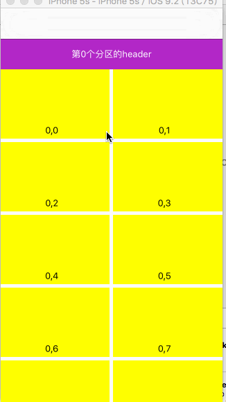

StickyHeaderFlowLayout
==============

实现UICollectionView的section header悬停效果.效果和UITableView的plain模式下的header section效果相同<br /><br />
<p align="center" >
<br /><br />
</p>


使用示例 EXAMPLE
===============
将我们的UICollectionView的布局替换为YLStickyHeaderFlowLayout即可

YLStickyHeaderFlowLayout核心源码
===============
```objective-c
- (NSArray *) layoutAttributesForElementsInRect:(CGRect)rect {
    if (self.disableStickyFlow) {
        return [super layoutAttributesForElementsInRect:rect];
    }
    NSMutableArray<UICollectionViewLayoutAttributes *> *allItems ;
    //collectionView中的item（包括cell和header、footer这些）的《结构信息》.关键!!!!cell,header,footer都是利用这个数组的,在这个中,原来创建的section等,要按顺序存放到数组中来!
    NSArray *originalAttributes = [super layoutAttributesForElementsInRect:rect];
    //allItems = (NSMutableArray *)originalAttributes ;
    allItems = [originalAttributes mutableCopy];//实际上layoutAttributesForElementsInRect返回的是NSMutableArray,所以,可以直接强转
    
    NSMutableDictionary *headers = [[NSMutableDictionary alloc] init];//存放每个section的header
    NSMutableDictionary<NSNumber *,UICollectionViewLayoutAttributes *> *lastCells = [[NSMutableDictionary alloc] init];//存放的是每个section的最后一个cell
    [allItems enumerateObjectsUsingBlock:^(UICollectionViewLayoutAttributes * _Nonnull obj, NSUInteger idx, BOOL * _Nonnull stop) {
        
        NSIndexPath *indexPath = [obj indexPath];
        BOOL isHeader = [[obj representedElementKind] isEqualToString:UICollectionElementKindSectionHeader];
        BOOL isFooter = [[obj representedElementKind] isEqualToString:UICollectionElementKindSectionFooter];
        
        if (isHeader) {
            headers[@(indexPath.section)] = obj;
        } else if (isFooter) {
            // 不处理
        } else {
            //其实用这两句也是可以的
            //NSNumber *sectionObj = @(indexPath.section);
            //lastCells[sectionObj] = obj;
            
            UICollectionViewLayoutAttributes *currentAttribute = lastCells[@(indexPath.section)];
            // 确保取到的是section中最后一个cell
            if ( ! currentAttribute || indexPath.row > currentAttribute.indexPath.row) {
                [lastCells setObject:obj forKey:@(indexPath.section)];
            }
        }
        
        //如果按照正常情况下,header离开屏幕被系统回收，而header的层次关系又与cell相等，如果不去理会，会出现cell在header上面的情况
        //通过打印可以知道cell的层次关系zIndex数值为0，我们可以将header的zIndex设置成1，如果不放心，也可以将它设置成非常大，这里随便填了个1024
        if (isHeader) {
            obj.zIndex = 1024;
        } else {
            // For iOS 7.0, the cell zIndex should be above sticky section header
            obj.zIndex = 1;
        }
        
    }];
    
    
    [lastCells enumerateKeysAndObjectsUsingBlock:^(NSNumber * _Nonnull key, UICollectionViewLayoutAttributes * _Nonnull obj, BOOL * _Nonnull stop) {
        NSIndexPath *indexPath = obj.indexPath;
        NSNumber *indexPathKey = @(indexPath.section);
        
        UICollectionViewLayoutAttributes *header = headers[indexPathKey];
        
        if ( ! header) {
            // CollectionView自动将不再bounds内的headers移除了,所以,Headers可能为nil.这种情况下我们需要重新将其加回来 automatically removes headers not in bounds
            header = [self layoutAttributesForSupplementaryViewOfKind:UICollectionElementKindSectionHeader
                                                          atIndexPath:[NSIndexPath indexPathForItem:0 inSection:indexPath.section]];
            
            if (!CGSizeEqualToSize(CGSizeZero, header.frame.size)) {
                [allItems addObject:header];
            }
        }
        if (!CGSizeEqualToSize(CGSizeZero, header.frame.size)) {
            [self updateHeaderAttributes:header lastCellAttributes:lastCells[indexPathKey]];
        }
    }];
    
    
    return allItems;
    
}


